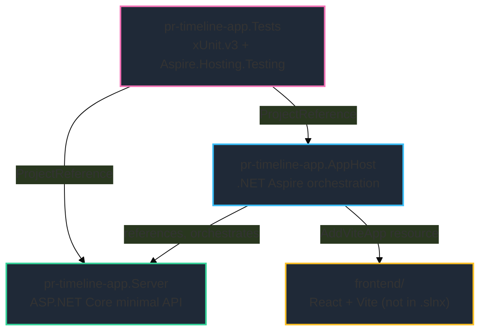
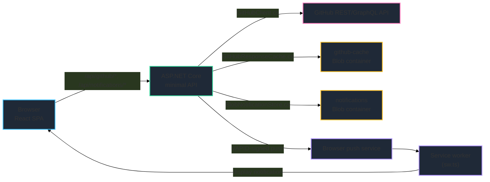

# Architecture — pr-dashboard

See [`../../indexes/ARCHITECTURE_INDEX.md`](../../indexes/ARCHITECTURE_INDEX.md) for a
file-by-file index. This document is the narrative version.

## Solution Shape

`pr-timeline-app.slnx` defines three .NET projects — this is a **multi-project .NET
solution with an embedded frontend**, not an npm-workspace-style monorepo:

## Backend: Flat Minimal-API Pattern

`pr-timeline-app.Server` deliberately avoids a layered Accessor/Manager/Engine architecture
(confirmed via grep — zero hits for such base classes). Instead:

- `Program.cs` is the composition root: registers DI services, configures the request
  pipeline, and maps route groups.
- Each feature area is a pair of files: a static `*Routes.cs` class with a
  `Map<Feature>Routes(IEndpointRouteBuilder)` extension method, and a `*Service.cs` class
  holding the corresponding business logic, injected into route handlers via minimal-API
  parameter binding.
- External GitHub API access is centralized in `GitHubClient.cs`.
- A single global exception handler (`GitHubExceptionHandlingExtensions.cs`) converts
  unhandled exceptions to RFC 7807 Problem Details responses — see
  [`../api/README.api.md`](../api/README.api.md) for the exact shape.

New backend features should follow this same pattern (see
`../../templates/backend-route-service-pair/`).

## Orchestration: .NET Aspire

`pr-timeline-app.AppHost/AppHost.cs` defines the distributed application:

- An Azure Storage resource (`AddAzureStorage`), run as the Azurite emulator locally
  (`RunAsEmulator`, with a data volume so cache snapshots survive container recreation).
- Two blob containers carved out of that storage resource: `github-cache` and
  `notifications`, kept separate so the cache-clear command / TTL eviction can never touch a
  user's push subscription.
- The `pr-timeline-app.Server` project, wired to both containers via `WithReference` /
  `WaitFor`, with an HTTP health check at `/health`.
- In publish mode (Azure deploy), OAuth and VAPID secrets are wired in as Aspire parameters,
  and the Server's Azure Container Apps scale template is pinned to exactly one replica
  (`MinReplicas = MaxReplicas = 1`) — see the Notifications section of
  [`../features/README.features.md`](../features/README.features.md) for why.
- In run mode, a Vite-backed frontend resource (`AddViteApp`) is added and wired to the
  Server; in publish mode the built frontend's static files are instead published into the
  Server's `wwwroot` (`PublishWithContainerFiles`).

## Frontend: React SPA

Served by Vite directly during local development (`aspire start` → `http://localhost:5173/`)
and by the ASP.NET Core Server (`UseFileServer()`) in production. Structure:

- `components/dashboard/` — dashboard views plus `focusQueue.ts`, which holds the focus-queue
  bucket/exclusion business rules.
- `components/detail/` — single-PR detail views.
- `utils/` — pure logic (PR/attention modeling, signal-pill dedupe, Web Push client logic,
  formatting, HTTP helpers, routing).

## Testing Architecture

- `pr-timeline-app.Tests` references both `pr-timeline-app.AppHost` and
  `pr-timeline-app.Server`, and uses `Aspire.Hosting.Testing` for tests that need a (partial)
  running distributed application — appropriate for smoke-testing the GitHub API integration
  surface end-to-end.
- Frontend tests are co-located with source and run under vitest with a jsdom environment.

## Data Flow

